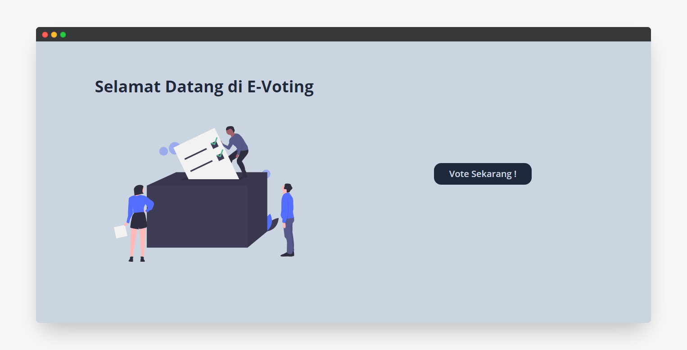

# Vote App

## Build Setup

1. Get the server side repo at [here](https://github.com/hendraaagil/vote-server)
2. Change the baseURL of axios instance at `src/axios.js`
3. Install all required dependencies  
   `yarn install`
4. Run this app  
   `yarn start`

## Learn More

- To learn React, check out the [React documentation](https://id.reactjs.org/).
- To learn TailwindCSS, checkout the [Tailwind documentation](https://tailwindcss.com/).
